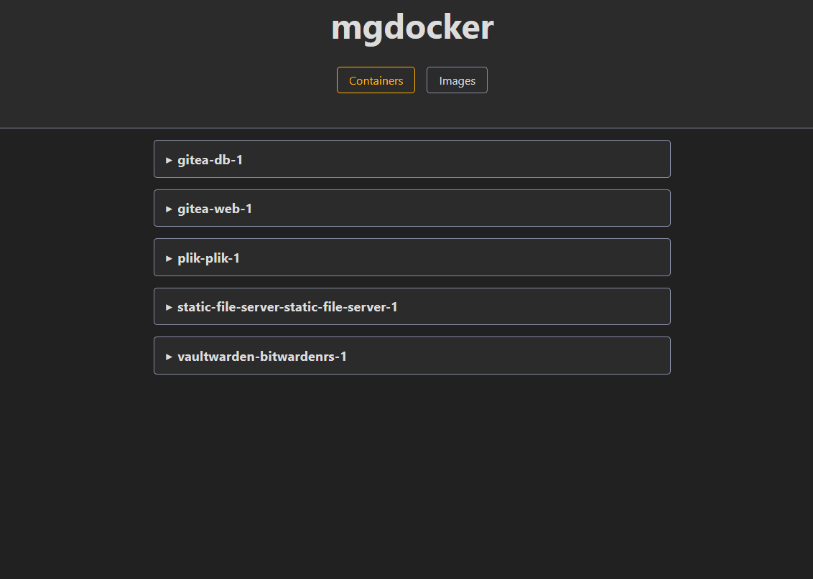

# mgdocker

A web application for managing docker containers. Built for my personal needs.

- rust
- leptos
- htmx
- axum

## Features
- docker compose pull
- docker compose down && docker compose up -d
- view docker_compose.yml
- prune images

